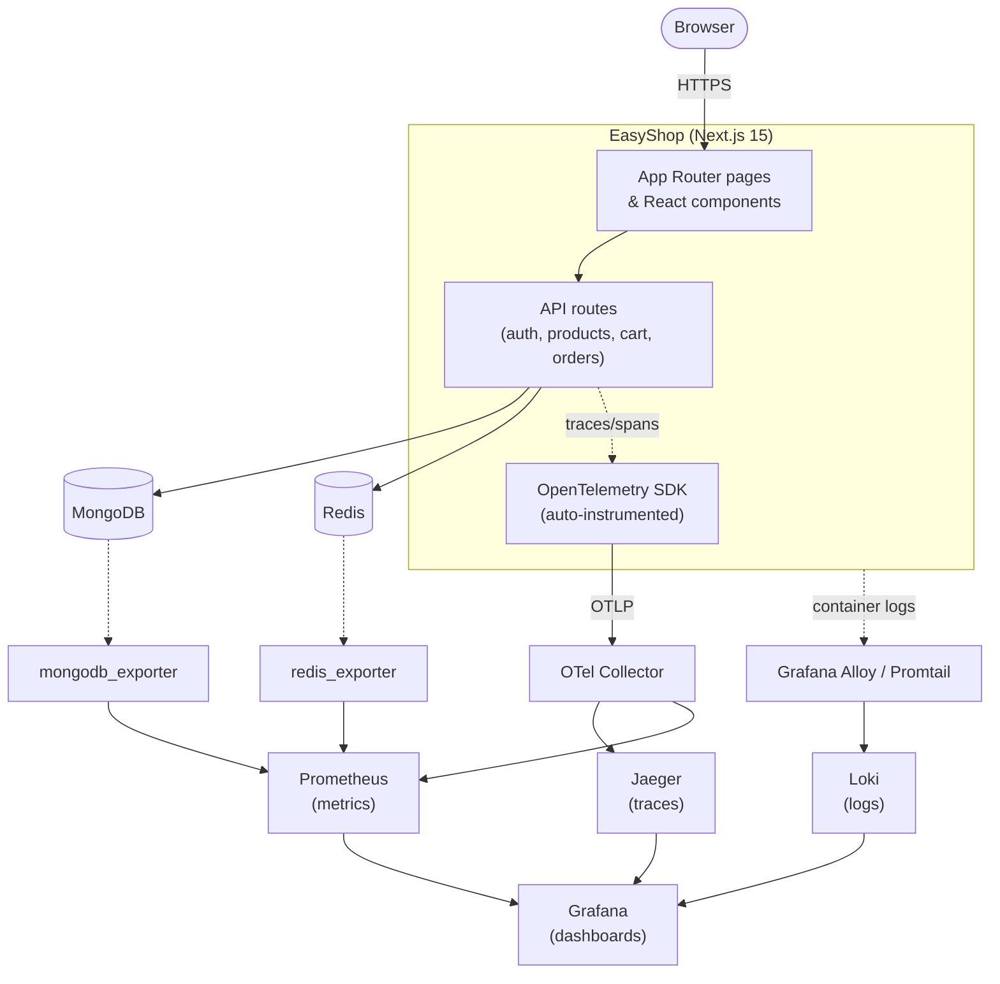
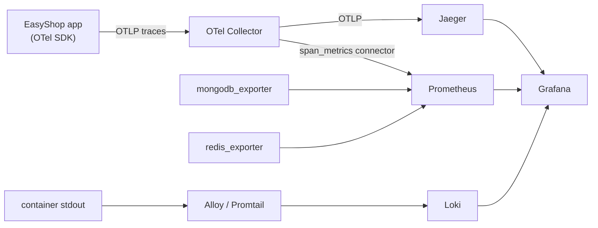
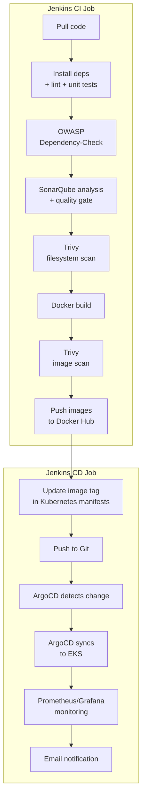
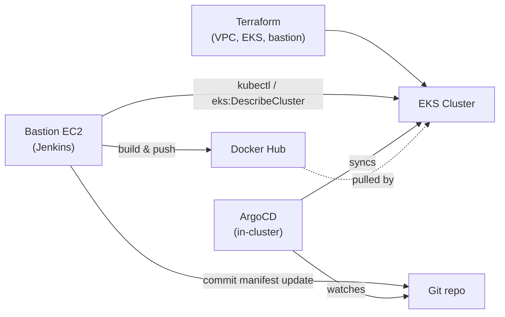

# EasyShop

[](LICENSE)
[](https://nextjs.org/)
[](https://www.typescriptlang.org/)
[](https://react.dev/)
[](https://nodejs.org/)

A production-grade, full-stack e-commerce platform built with Next.js 15 (App Router), TypeScript, MongoDB, and Redis — instrumented end-to-end with OpenTelemetry and shipped with a complete GitOps deployment pipeline (Terraform → EKS → Jenkins → ArgoCD) and a full observability stack (Prometheus, Grafana, Loki, Jaeger).

This README covers everything needed to run the project locally, understand its architecture, and deploy it to production.

## Table of Contents

- [Features](#features)
- [Tech Stack](#tech-stack)
- [Architecture](#architecture)
- [Project Structure](#project-structure)
- [Getting Started](#getting-started)
  - [Prerequisites](#prerequisites)
  - [Quick Start (Docker Compose)](#quick-start-docker-compose)
  - [Environment Variables](#environment-variables)
  - [Running Without Docker](#running-without-docker)
- [Observability](#observability)
- [CI/CD Pipeline](#cicd-pipeline)
- [Production Deployment](#production-deployment)
- [Testing](#testing)
- [Available Scripts](#available-scripts)
- [Security](#security)
- [Troubleshooting](#troubleshooting)
- [Contributing](#contributing)
- [License](#license)

## Features

- Modern, responsive storefront with dark/light theme support
- JWT-based authentication with Redis-backed session/token blacklisting
- Real-time cart management via Redux Toolkit
- Product search, filtering, sorting, and category browsing
- Order placement and order history
- Admin-capable product API with role-based authorization
- Full request tracing, metrics, and log aggregation out of the box

## Tech Stack

| Layer | Technology |
|---|---|
| Framework | Next.js 15 (App Router), React 19, TypeScript |
| Styling | Tailwind CSS, Radix UI, shadcn-style components |
| State | Redux Toolkit |
| Database | MongoDB (Mongoose ODM) |
| Cache / Sessions | Redis (ioredis) |
| Auth | JWT (`jose`), bcrypt password hashing |
| Validation | Zod |
| Testing | Jest, ts-jest |
| Containerization | Docker (multistage builds), Docker Compose |
| Orchestration | Kubernetes (EKS), Kustomize |
| Infrastructure as Code | Terraform (AWS: VPC, EKS, IAM, bastion) |
| CI | Jenkins (OWASP Dependency-Check, SonarQube, Trivy, tests, Docker build/push) |
| CD | ArgoCD (GitOps) |
| Observability | OpenTelemetry, Prometheus, Grafana, Loki, Jaeger, Grafana Alloy/Promtail |

## Architecture



## Project Structure

```
EasyShop/
├── src/
│   ├── app/                  # Next.js App Router: pages + API routes
│   ├── components/           # React components (UI, forms, sidebars, etc.)
│   ├── lib/
│   │   ├── auth/             # JWT/session auth logic
│   │   ├── models/           # Mongoose schemas
│   │   ├── redis/            # Redis client + cache helpers
│   │   ├── validation/       # Zod schemas shared across routes/tests
│   │   └── features/         # Redux slices
│   ├── middleware.ts         # Edge middleware (auth-state header)
│   └── instrumentation.ts    # OpenTelemetry registration (Node.js runtime)
├── __tests__/                # Jest unit tests
├── scripts/
│   ├── migrate-data.ts       # Seeds MongoDB from .db/db.json
│   └── Dockerfile.migration  # Minimal image for the migration job
├── observability/            # Config for the local docker-compose observability stack
│   ├── otel-collector-config.yaml
│   ├── jaeger-config.yaml
│   ├── loki-config.yaml
│   ├── promtail-config.yaml
│   ├── prometheus.yml
│   └── grafana/               # Provisioned datasources + dashboards
├── kubernetes/                # Kustomize-managed manifests for the app + DB tier
│   └── argocd/                 # ArgoCD Application definitions (GitOps)
├── terraform/                 # AWS infrastructure (VPC, EKS, bastion, security groups)
├── Dockerfile                 # Multistage build → standalone Next.js output
├── docker-compose.yml         # Full local stack: app + DB + observability
├── Jenkinsfile                # CI/CD pipeline definition
└── sonar-project.properties   # SonarQube project config
```

## Getting Started

### Prerequisites

- [Docker](https://docs.docker.com/get-docker/) and Docker Compose
- Node.js ≥ 24 (only needed if running outside Docker)
- `git`

### Quick Start (Docker Compose)

This brings up the entire stack — the app, MongoDB, Redis, and the full observability pipeline (OpenTelemetry Collector, Jaeger, Prometheus, Loki, Grafana, DB exporters) — with one command.

```bash
git clone https://github.com/<YOUR_GITHUB_ORG>/<YOUR_REPO>.git
cd EasyShop

cp .env.example .env.local
# Fill in NEXTAUTH_SECRET and JWT_SECRET, e.g.:
#   openssl rand -base64 32   -> NEXTAUTH_SECRET
#   openssl rand -hex 32      -> JWT_SECRET

docker compose up -d --build
```

The migration service seeds MongoDB with the demo product catalog automatically and only needs to run once (it exits after seeding).

Once everything is healthy (`docker compose ps`), the following are available:

| Service | URL | Credentials |
|---|---|---|
| EasyShop app | http://localhost:3000 | — |
| Grafana | http://localhost:3001 | `admin` / `admin` (change on first login) |
| Prometheus | http://localhost:9090 (internal to the compose network by default; see note below) | — |
| Jaeger UI | http://localhost:16686 | — |

> Prometheus, Loki, and the OTel Collector aren't published to the host by default (only accessed via Grafana's provisioned datasources) — everything you need to explore metrics/logs/traces is reachable through Grafana. Add a `ports:` mapping in `docker-compose.yml` for `prometheus` if you want to hit its UI directly.

Stop everything with `docker compose down` (add `-v` to also wipe the databases/observability data volumes).

### Environment Variables

Copy `.env.example` to `.env.local` and fill in the two secrets. Everything else already has sane local-dev defaults wired up in `docker-compose.yml`.

| Variable | Purpose | Required |
|---|---|---|
| `MONGODB_URI` | MongoDB connection string | Yes |
| `REDIS_URI` | Redis connection string | Yes |
| `NEXTAUTH_URL` | Public base URL of the app | Yes |
| `NEXT_PUBLIC_API_URL` | Public base URL for API calls | Yes |
| `NEXTAUTH_SECRET` | Session/cookie signing secret | Yes |
| `JWT_SECRET` | JWT signing secret | Yes |
| `OTEL_EXPORTER_OTLP_ENDPOINT` | Where traces/metrics are exported (OTel Collector) | No (defaults set in compose/K8s) |
| `OTEL_SERVICE_NAME` | Service name reported in traces | No (defaults to `easyshop`) |

Never commit real values for `NEXTAUTH_SECRET`/`JWT_SECRET` — `.env.local` is gitignored.

### Running Without Docker

Requires a local or remote MongoDB + Redis instance.

```bash
npm install
npm run migrate   # seed the database once
npm run dev
```

The app will be available at http://localhost:3000. Note: without the OTel Collector/Jaeger/Loki running, tracing calls will simply fail to export silently (no impact on app functionality).

## Observability

Every HTTP request and every MongoDB/Redis call is automatically traced via OpenTelemetry (`src/instrumentation.ts`) — no manual instrumentation per route. Traces are exported via OTLP to an OTel Collector, which:

- forwards spans to **Jaeger** for the trace explorer, and
- derives RED metrics (Rate, Errors, Duration) from those same spans via the **spanmetrics connector**, exposed to **Prometheus** — this is how HTTP and database call latency show up in Grafana without a hand-written metrics endpoint.

Container logs are shipped to **Loki** (via Grafana Alloy in Kubernetes, Promtail in Docker Compose). **MongoDB** and **Redis** get dedicated Prometheus exporters for server-level metrics (connections, ops/sec, memory) distinct from application-side call latency.



**Grafana** ships pre-provisioned with:
- **Datasources**: Prometheus, Loki, Jaeger
- **Dashboards**: "EasyShop Golden Signals" (HTTP/DB request rate, latency percentiles, error rate), plus community MongoDB and Redis dashboards (imported by chart ID in the Kubernetes/ArgoCD deployment)

In Kubernetes, the same stack is deployed as ArgoCD Applications (`kubernetes/argocd/{loki,jaeger,alloy,otel-collector,monitoring}.yaml`), alongside `kube-prometheus-stack` for cluster/node-level metrics — no extra manual setup required beyond `kubectl apply -f kubernetes/argocd/`.

## CI/CD Pipeline



Every push runs the full CI job (`Jenkinsfile`): dependency install, lint, unit tests (Jest), OWASP Dependency-Check, SonarQube static analysis with a quality gate, a Trivy filesystem scan, then Docker builds for the app and migration images, a Trivy image scan, and a push to the registry. The CD stage updates the image tag in `kubernetes/` and pushes to Git, which ArgoCD picks up automatically (`syncPolicy.automated`) and reconciles onto the cluster.

> Jenkins' shared library (build/scan/push helper functions), SonarQube server connection, and SMTP for email notifications are operator-configured in Jenkins itself — see comments in `Jenkinsfile` for the exact configuration keys expected.

## Production Deployment

The production path is a GitOps pipeline: **Terraform** provisions AWS infrastructure, **Jenkins** (running on a bastion EC2 instance) builds/scans/pushes images and updates manifests, and **ArgoCD** continuously reconciles the Kubernetes cluster from Git.



High-level steps (see inline comments in `terraform/` and `kubernetes/argocd/` for exact values to fill in):

1. **Provision infrastructure**: `cd terraform && terraform init && terraform apply` (fill in `terraform.tfvars` from `terraform.tfvars.example` — at minimum set `admin_cidr` to your own IP, never `0.0.0.0/0`).
2. **Retrieve the bastion SSH key** from AWS Secrets Manager (see `terraform` output `retrieve_key_command`) and SSH in.
3. **Bootstrap Jenkins** on the bastion (`terraform/modules/bastion/install-tools.sh`, `system-service.sh`), configure the GitHub/Docker Hub credentials and shared library referenced in `Jenkinsfile`.
4. **Point kubectl at the cluster**: `aws eks update-kubeconfig --region <region> --name <cluster_name>`.
5. **Install ArgoCD** and apply the bootstrap Applications: `kubectl apply -f kubernetes/argocd/` (fill in the `repoURL`/`targetRevision` placeholders in `application.yaml`/`project.yaml` with your own fork first).
6. **Install NGINX Ingress + cert-manager** for TLS termination (see comments in `kubernetes/selfsigned-issuer.yaml` — swap for a real ACME issuer on a real domain).
7. Push to your repo — ArgoCD takes it from there.

## Testing

```bash
npm test          # run the Jest suite
npm run lint      # ESLint
npx tsc --noEmit  # type-check
```

Unit tests cover the security-sensitive validation logic in `src/lib/validation/products.ts` (ReDoS-safe search, sort-field allowlisting, zod schema mass-assignment guarding). Coverage and JUnit reports are generated automatically in CI (`jest-junit`, wired into the Jenkinsfile's test stage).

## Available Scripts

| Script | Description |
|---|---|
| `npm run dev` | Start the Next.js dev server |
| `npm run build` | Production build (standalone output) |
| `npm start` | Run the production build |
| `npm run lint` | Run ESLint |
| `npm test` | Run the Jest test suite |
| `npm run migrate` | Seed MongoDB from `.db/db.json` |

## Security

- Secrets (`NEXTAUTH_SECRET`, `JWT_SECRET`) are never hardcoded — `.env.local` is gitignored, and Kubernetes reads them from a `Secret` (not a `ConfigMap`).
- Passwords are hashed with bcrypt; JWTs are verified server-side on every authenticated request, with Redis-backed token blacklisting on logout.
- API input is validated with Zod (see `src/lib/validation/products.ts`) to prevent mass assignment; search input is regex-escaped to prevent ReDoS; sort fields are allowlisted.
- Docker images run as a non-root user with a read-only root filesystem in Kubernetes; the app's Docker build never bakes secrets into image layers.
- Dependencies are scanned by OWASP Dependency-Check and Trivy (filesystem + image) on every CI run; static analysis runs through SonarQube with an enforced quality gate.
- Terraform restricts bastion SSH/Jenkins UI and the EKS public API endpoint to an operator-supplied CIDR (never `0.0.0.0/0`), stores the bastion SSH key in Secrets Manager (not on disk), and enables VPC flow logs + KMS envelope encryption for EKS secrets.

If you discover a security issue, please open an issue rather than a public PR with exploit details.

## Troubleshooting

**MongoDB connection errors** — confirm the `mongodb` service is healthy (`docker compose ps`) and `MONGODB_URI` in `.env.local` matches the compose service name (`mongodb`, not `localhost`, when running in Docker).

**Build fails with a type error after `npm install`** — delete `.next` and `node_modules`, then reinstall: `rm -rf .next node_modules && npm install`.

**No traces showing up in Jaeger** — confirm `OTEL_EXPORTER_OTLP_ENDPOINT` is set on the `app` service and points at `http://otel-collector:4318`; check `docker compose logs otel-collector` for connection errors to Jaeger.

**Grafana shows no data** — dashboards need a few requests to hit the app first (metrics are derived from real traffic); refresh after browsing the storefront for a minute.

## Contributing

1. Fork the repository and create a branch: `git checkout -b feature/my-feature`
2. Make your changes, and run `npm test && npm run lint && npx tsc --noEmit`
3. Commit and push, then open a Pull Request

## License

Licensed under the [MIT License](LICENSE).
