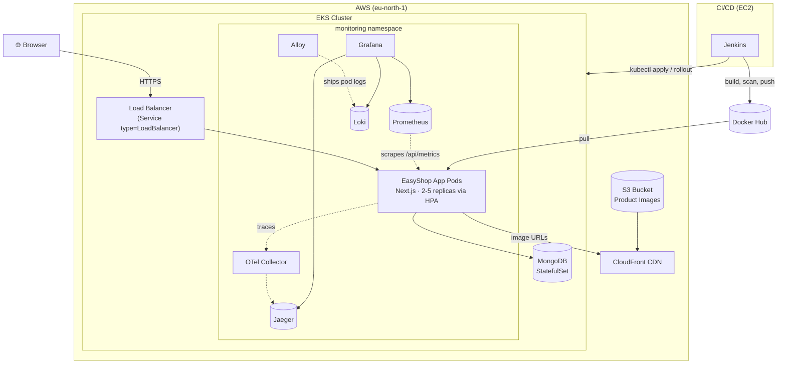
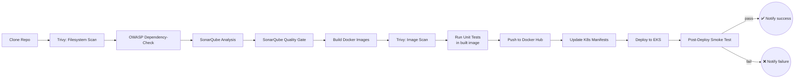
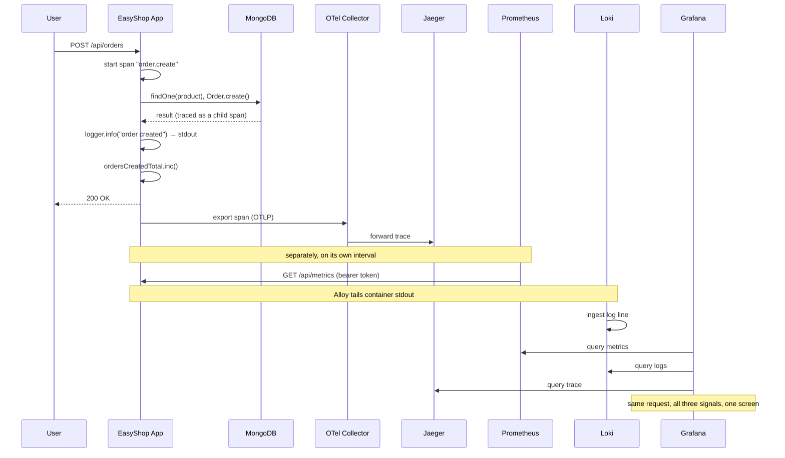

# 🛍️ EasyShop — Production-Ready E-Commerce Platform

<p align="center">
  
</p>

<p align="center">
  <a href="https://nextjs.org/"></a>
  <a href="https://react.dev/"></a>
  <a href="https://www.typescriptlang.org/"></a>
  <a href="https://www.mongodb.com/"></a>
  <a href="https://tailwindcss.com/"></a>
  <a href="https://www.docker.com/"></a>
  <a href="https://kubernetes.io/"></a>
  <a href="LICENSE"></a>
  <a href="https://deepwiki.com/IshuAgrawal11/production-ready-e-commerce-application"></a>
</p>

<p align="center">
  A full-stack, security-hardened e-commerce platform built with the Next.js App Router,
  MongoDB, and Redux Toolkit — with a complete DevSecOps pipeline (Terraform, Jenkins,
  Trivy, OWASP Dependency-Check, SonarQube) to ship it to AWS EKS.
</p>

---

## Table of Contents

- [Overview](#overview)
- [Features](#features)
- [Tech Stack](#tech-stack)
- [Architecture](#architecture)
- [CI/CD Pipeline](#cicd-pipeline)
- [Observability](#observability)
- [Getting Started](#getting-started)
  - [Prerequisites](#prerequisites)
  - [Quickstart with Docker Compose](#quickstart-with-docker-compose)
  - [Local Development without Docker](#local-development-without-docker)
  - [Environment Variables](#environment-variables)
- [Project Structure](#project-structure)
- [Testing](#testing)
- [Security](#security)
- [Deploying to AWS (EKS)](#deploying-to-aws-eks)
- [Contributing](#contributing)
- [License](#license)

---

## Overview

EasyShop is a multi-category online store — groceries, gadgets, clothing, books, bakery,
makeup, medicine, bags, and furniture — built as a reference implementation of a
**production-ready** Next.js application: not just a storefront UI, but the full path from
`git clone` to a load-balanced deployment on AWS, with the security and CI gates a real
production system needs along the way.

It's built around a custom JWT + httpOnly-cookie auth system, a MongoDB data layer with
server-side price/stock validation on every cart and order mutation (client-supplied prices
are never trusted), and a containerized build that runs identically on a laptop via Docker
Compose or on AWS EKS via Terraform + Jenkins.

## Features

- 🛒 **Full storefront** — category browsing, filters (price/color/size/sort), search, product
  detail pages, wishlists, and a persistent cart.
- 🔐 **Custom auth** — JWT sessions in httpOnly/secure/sameSite cookies, bcrypt password
  hashing, rate-limited login/register, role-based access control (`user`/`admin`).
- 💳 **Server-authoritative checkout** — every price and stock check on `/api/cart` and
  `/api/orders` is recomputed from the database; the client's numbers are never trusted.
- 📦 **Order management** — order history, order detail/status, and admin-only status
  transitions.
- 🖼️ **CDN-backed product images** — S3 + CloudFront in production, with a zero-config
  fallback to local `public/` assets for development.
- 🧪 **Tested & typed** — Vitest unit tests, strict TypeScript, ESLint 9 flat config with
  `eslint-plugin-security`.
- 🚀 **DevSecOps pipeline** — Jenkins pipeline with Trivy (filesystem *and* image scanning),
  OWASP Dependency-Check, SonarQube quality gates, and an automated post-deploy smoke test.
- ☁️ **Infrastructure as Code** — the entire AWS footprint (VPC, EKS cluster + managed node
  group, S3, CloudFront, IAM) is provisioned by Terraform using the community
  `terraform-aws-modules`.
- 📊 **Full observability** — metrics, logs, and distributed tracing (Prometheus, Loki,
  Jaeger, wired up via OpenTelemetry) unified in Grafana, with the same stack running
  identically in Docker Compose and on EKS.

## Tech Stack

| Layer | Technology |
|---|---|
| **Framework** | Next.js 15 (App Router, Server Actions, Server Components) |
| **UI** | React 18, Tailwind CSS, Radix UI, Framer Motion |
| **State** | Redux Toolkit |
| **Language** | TypeScript 5 (strict mode) |
| **Database** | MongoDB via Mongoose |
| **Auth** | Custom JWT (`jose`) + httpOnly cookies, `bcryptjs` |
| **Validation** | Zod |
| **Testing** | Vitest |
| **Containers** | Docker, Docker Compose |
| **Orchestration** | Kubernetes (Amazon EKS) |
| **IaC** | Terraform (`terraform-aws-modules/vpc`, `terraform-aws-modules/eks`) |
| **CI/CD** | Jenkins |
| **Security scanning** | Trivy, OWASP Dependency-Check, SonarQube |
| **Cloud** | AWS (EKS, EC2, S3, CloudFront, IAM) |
| **Metrics** | Prometheus, `prom-client`, `mongodb_exporter` |
| **Logs** | Grafana Loki, Grafana Alloy |
| **Tracing** | Jaeger, OpenTelemetry (`@vercel/otel`) |
| **Dashboards** | Grafana |

## Architecture



The app itself is a single Next.js deployment handling both the storefront (Server
Components) and the API (Route Handlers under `src/app/api/`) — there's no separate backend
service. MongoDB is the only stateful dependency; product images are served from
CloudFront in production or from `public/` locally.

## CI/CD Pipeline

Every push runs the full Jenkins pipeline: static/dependency/image security scans, an
in-container test run, then an automated deploy with a post-deploy health check gate.



Any HIGH/CRITICAL vulnerability found by either Trivy stage, or a failed SonarQube quality
gate, fails the build before anything reaches production. The smoke test stage polls the
live load balancer's `/api/health` endpoint after deploy — a rollout that "succeeds" but
serves a broken app still fails the pipeline.

## Observability

Metrics, logs, and traces, unified in one Grafana instance — the exact same stack runs
locally via Docker Compose and on EKS via Terraform-managed Helm releases, so what you see
on your laptop is what you get in production.

| Pillar | Tool | How it gets there |
|---|---|---|
| **Metrics** | Prometheus | The app exposes `/api/metrics` (`prom-client`, bearer-token protected); Prometheus scrapes it, the OTel Collector, and `mongodb_exporter` |
| **Logs** | Loki | Structured JSON (`pino`) to stdout → Grafana Alloy (container/pod log discovery) → Loki |
| **Traces** | Jaeger | `@vercel/otel` in `src/instrumentation.ts` → OTLP → OTel Collector → Jaeger |
| **Dashboards** | Grafana | Auto-provisioned datasources (Prometheus/Loki/Jaeger) + two custom dashboards (`EasyShop — Application`, `EasyShop — MongoDB`), auto-imported on startup |



Kubernetes/node-level dashboards (~20 of them) come bundled with kube-prometheus-stack out
of the box — only the app and MongoDB dashboards needed building from scratch here.

**Reaching the UIs:**

| | Local (Docker Compose) | EKS |
|---|---|---|
| Grafana | http://localhost:3001 (`admin` / value of `GRAFANA_ADMIN_PASSWORD`, default `admin`) | `kubectl port-forward -n monitoring svc/kube-prometheus-stack-grafana 3000:80` (password: `terraform output grafana_admin_password`) |
| Prometheus | http://localhost:9090 | `kubectl port-forward -n monitoring svc/kube-prometheus-stack-prometheus 9090:9090` |
| Jaeger | http://localhost:16686 | `kubectl port-forward -n monitoring svc/jaeger-query 16686:16686` |

(`port-forward`, not a public LoadBalancer, for the same reason the app itself isn't behind
a domain yet — see [Deploying to AWS](#deploying-to-aws-eks). Expose these properly once you
have TLS and a real access-control story in front of them.)

## Getting Started

### Prerequisites

- [Docker](https://docs.docker.com/get-docker/) & Docker Compose (the fastest way to run this)
- [Node.js 22+](https://nodejs.org/) and npm — only needed for local (non-Docker) development
- Git

### Quickstart with Docker Compose

This spins up the app, MongoDB (with authentication enabled), a one-shot data-seeding job,
and the full observability stack (Prometheus, Grafana, Loki, Jaeger, OTel Collector) — no
local Node/Mongo install required.

```bash
git clone https://github.com/IshuAgrawal11/production-ready-e-commerce-application.git
cd production-ready-e-commerce-application

cp .env.example .env
# Edit .env: set JWT_SECRET and METRICS_TOKEN (openssl rand -hex 32 each), the Mongo
# passwords, and MONGO_EXPORTER_PASSWORD.
# Leave CDN_URL/CDN_HOSTNAME empty to serve product images from public/ locally.

docker compose up --build -d
```

Open **http://localhost:3000** for the app, **http://localhost:3001** for Grafana (see
[Observability](#observability)). To follow logs: `docker compose logs -f app`. To stop:
`docker compose down` (add `-v` to also wipe all data volumes, including Mongo/Prometheus/
Loki/Grafana).

### Local Development without Docker

Requires a MongoDB instance reachable at whatever `MONGODB_URI` you set in `.env`.

```bash
npm install
npm run migrate   # seeds MongoDB from .db/db.json
npm run dev        # http://localhost:3000
```

### Environment Variables

See [`.env.example`](.env.example) for the full, documented list. The essentials:

| Variable | Purpose |
|---|---|
| `MONGODB_URI` | MongoDB connection string (with credentials for Docker Compose) |
| `JWT_SECRET` | Signs/verifies auth tokens — generate with `openssl rand -hex 32` |
| `CDN_URL` / `CDN_HOSTNAME` | Product image CDN; leave empty locally to use `public/` instead |
| `NEXT_PUBLIC_API_URL` | Base URL the client uses to call the API |
| `MONGO_INITDB_ROOT_USERNAME` / `MONGO_INITDB_ROOT_PASSWORD` | Mongo container root credentials (Docker Compose only) |
| `MONGO_APP_USERNAME` / `MONGO_APP_PASSWORD` | Least-privilege app-level Mongo user, created by `mongo-init/` |
| `MONGO_EXPORTER_USERNAME` / `MONGO_EXPORTER_PASSWORD` | Separate `clusterMonitor`-role user for `mongodb_exporter` — deliberately not the app's `readWrite` user |
| `METRICS_TOKEN` | Bearer token Prometheus sends to scrape `/api/metrics` — generate with `openssl rand -hex 32` |
| `OTEL_EXPORTER_OTLP_ENDPOINT` | Where the app sends traces (the OTel Collector, not Jaeger directly) |

`.env` is git-ignored on purpose — never commit real secrets.

## Project Structure

```
├── src/
│   ├── app/                  # Next.js App Router: pages + API route handlers
│   │   └── api/               # REST-ish API (auth, products, cart, orders, health)
│   ├── components/            # UI components (cards, forms, filters, sliders, ui/)
│   ├── lib/
│   │   ├── auth/               # JWT sign/verify, cookie config
│   │   ├── features/           # Redux slices (auth, cart, sidebar)
│   │   ├── models/              # Mongoose schemas (User, Product, Cart, Order)
│   │   ├── validation/          # Zod schemas
│   │   └── constants/           # Shared pricing constants
│   ├── instrumentation.ts     # OpenTelemetry registration (traces)
│   └── middleware.ts           # Route protection, redirect/header hardening
├── scripts/
│   ├── migrate-data.ts        # Seeds MongoDB from .db/db.json
│   └── Dockerfile.migration    # Migration job image
├── observability/             # otel-collector/prometheus/loki/alloy configs +
│                               # Grafana provisioning & dashboards (Docker Compose)
├── kubernetes/                # Namespace, ConfigMap/Secrets, Deployment, Service,
│                               # StatefulSet, HPA, Ingress, migration Job, mongodb-exporter,
│                               # ServiceMonitors, Grafana dashboard ConfigMaps (00-18)
├── terraform/                 # VPC, EKS cluster + node group, IAM, S3 + CloudFront,
│                               # observability Helm releases, Jenkins EC2 agent
│                               # (see terraform/bootstrap/ for remote state)
├── Jenkinsfile                # Full CI/CD pipeline definition
├── Dockerfile                 # Multi-stage build (deps → builder → runner)
├── docker-compose.yml         # App + MongoDB + migration + full observability stack
└── vitest.config.ts
```

## Testing

```bash
npm run test        # Vitest unit tests
npm run lint         # ESLint 9 (flat config) + eslint-plugin-security
npm run typecheck    # tsc --noEmit
```

## Security

This project treats security as a first-class concern, not an afterthought:

- **Auth**: JWT in an `httpOnly` + `secure` (production) + `sameSite=strict` cookie — never
  exposed to client-side JavaScript or returned in a JSON response body.
- **Input validation**: every API route that touches the database validates its input with
  Zod, closing off NoSQL-injection and mass-assignment vectors.
- **Server-authoritative money math**: cart and order totals are always recomputed
  server-side from the current `Product` price — a tampered client request can't change
  what you're charged.
- **Rate limiting** on `/api/auth/login` and `/api/auth/register`.
- **Security headers**: CSP, `X-Frame-Options`, `X-Content-Type-Options`,
  `Strict-Transport-Security`, `Referrer-Policy` on every response.
- **Least privilege**: MongoDB runs with authentication enabled everywhere (including local
  Docker Compose), using a dedicated non-root application user.
- **Supply chain**: Trivy scans both the filesystem and the built container images; OWASP
  Dependency-Check and SonarQube gate every CI run.

Found a vulnerability? Please open an issue rather than a public PR with exploit details.

## Deploying to AWS (EKS)

The short version — see the comments in `terraform/` and `Jenkinsfile` for the full detail:

1. **Bootstrap remote state** (recommended, one-time):
   ```bash
   cd terraform/bootstrap && terraform init && terraform apply
   ```
2. **Provision the AWS infrastructure** (VPC, EKS cluster + managed node group, IAM, S3 +
   CloudFront, EBS CSI driver, **and** the Prometheus/Grafana/Loki/Jaeger/OTel Collector
   Helm releases — `terraform/observability.tf`):
   ```bash
   cd terraform && terraform init && terraform plan   # review before applying
   terraform apply
   terraform output grafana_admin_password            # save this
   ```
3. **Point kubectl at the new cluster**:
   ```bash
   aws eks update-kubeconfig --region eu-north-1 --name easyshop
   ```
4. **Deploy the app** (`17`/`18` need the Prometheus Operator CRDs from step 2 to exist first):
   ```bash
   kubectl apply -f kubernetes/01-namespace.yaml -f kubernetes/02-mongodb-pv.yaml \
     -f kubernetes/03-mongodb-pvc.yaml -f kubernetes/04-configmap.yaml \
     -f kubernetes/05-secrets.yaml -f kubernetes/06-mongodb-service.yaml \
     -f kubernetes/13-mongodb-init-configmap.yaml -f kubernetes/07-mongodb-statefulset.yaml \
     -f kubernetes/14-mongodb-networkpolicy.yaml
   kubectl rollout status statefulset/mongodb -n easyshop
   kubectl apply -f kubernetes/08-easyshop-deployment.yaml -f kubernetes/09-easyshop-service.yaml \
     -f kubernetes/11-hpa.yaml -f kubernetes/15-easyshop-pdb.yaml -f kubernetes/16-mongodb-exporter.yaml \
     -f kubernetes/17-servicemonitors.yaml -f kubernetes/18-grafana-dashboards.yaml
   kubectl apply -f kubernetes/12-migration-job.yaml
   ```
5. Grab the load balancer hostname with `kubectl get svc easyshop-service -n easyshop`, and
   hit `http://<hostname>/api/health` to confirm it's live. Once you have a real domain,
   deploy `nginx-ingress-controller` + `cert-manager` and apply `00-cluster-issuer.yml` +
   `10-ingress.yaml` for TLS.

From there, the `Jenkinsfile` automates all of the above (plus the security scans and smoke
test) on every push.

## Contributing

Contributions are welcome!

1. Fork the repo and create a branch: `git checkout -b feature/my-feature`
2. Make your change, and make sure `npm run lint`, `npm run typecheck`, and `npm run test`
   all pass
3. Open a pull request describing what changed and why

Please don't include unrelated formatting-only diffs in feature PRs — it makes review harder.

## License

Distributed under the MIT License. See [`LICENSE`](LICENSE) for details.
